# Open RDMA Driver Installation Guide

This document provides the quick installation steps for the Open RDMA Driver. For detailed technical information and troubleshooting, please refer to the documents in the [detail](./open-rdma-driver/docs/zh-CN/detail/) folder.

If you are currently focusing on RTL simulation or the driver-side one-click test entry, it is recommended to also read:

- [RTL Simulation Guide](./open-rdma-driver/docs/zh-CN/rtl-simulation.md)
- [base_test Script Run Guide](./open-rdma-driver/docs/zh-CN/test/base_test_guide.md)

## Requirements

- Linux system (WSL2 supported)
- Rust toolchain
- Kernel version >= 6.6 (on WSL you need to compile the kernel module manually)

## Installation Steps

### 1. Install Rust Toolchain

**Run the following in any directory**:

```bash
curl --proto '=https' --tlsv1.2 -sSf https://sh.rustup.rs | sh
source ~/.cargo/env
```

Press `enter` to continue:

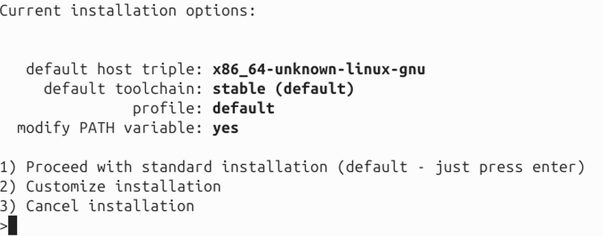

Success indicator:

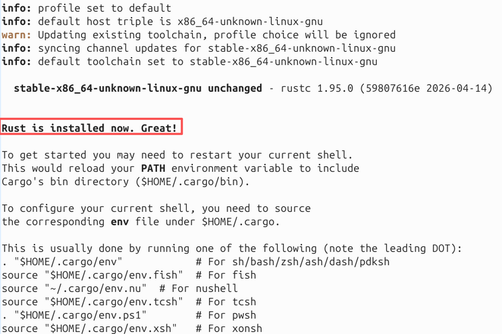

### 2. Install System Dependencies

**Run the following in any directory**:

```bash
sudo apt install cmake pkg-config libnl-3-dev libnl-route-3-dev libclang-dev libibverbs-dev
```

### 3. Clone the Project and Initialize Submodules

**Run the following in the directory where you want to place the project** (it is recommended to use a short path such as `/home/user/`):

```bash
git clone --recursive https://github.com/open-rdma/open-rdma-driver.git
cd open-rdma-driver
git checkout dev

# If you cloned without --recursive, you can initialize manually
git submodule update --init --recursive
```

**Note**: The project path should not be too long. It is recommended to use `/home/user/open-rdma-driver` instead of a deeply nested path. See: [Path Length Issue](./open-rdma-driver/docs/zh-CN/detail/path-length-issue.md)

### 4. Build and Load the Driver Module

**For WSL2 environment**, you need to prepare kernel headers first. Please refer to: [WSL2 Kernel Headers Preparation Guide](./open-rdma-driver/docs/zh-CN/detail/wsl-kernel-headers.md). Alternatively, you can use `make KBUILD_MODPOST_WARN=1` to skip using kernel headers, but this carries some risk.

**Run the following in the root directory of the `open-rdma-driver` project**:

```bash
# Build the driver
make

# If BTF generation fails (common on WSL), use:
# make KBUILD_MODPOST_WARN=1

# Load the driver module
sudo make install
```

**Run the following in any directory to verify that the driver is loaded successfully**:

```bash
lsmod | grep bluerdma
# Should show: bluerdma
```

Driver loaded successfully indicator:

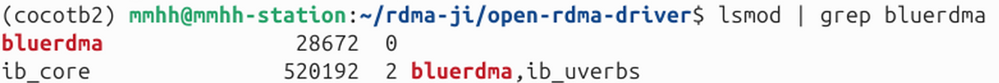

### 5. Configure Network Interfaces

Assign IP addresses to the Open RDMA virtual network interfaces.

**Run the following in any directory**:

```bash
sudo ip addr add 17.34.51.10/24 dev blue0
sudo ip addr add 17.34.51.11/24 dev blue1
```

**Run the following in any directory to verify configuration**:

```bash
ip addr show blue0
ip addr show blue1

# In simulation mode, it may be necessary to bring the interfaces down to prevent configuration from being cleared. The reason is currently unknown. No need for this step in Mock mode.
sudo ip link set dev blue0 down
sudo ip link set dev blue1 down
```

Seeing both inet and inet6 indicates success:

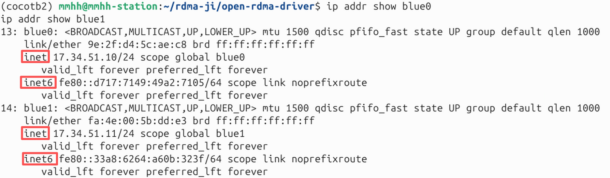

### 6. Allocate Huge Pages

The Open RDMA Driver requires huge pages. Use the provided script to allocate 512 MB of huge pages.

**Run the following in the root directory of the `open-rdma-driver` project**:

```bash
sudo ./scripts/hugepages.sh alloc 512
```

Success indicator:

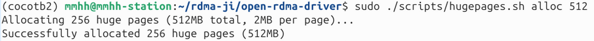

**Run the following in any directory to verify allocation**:

```bash
cat /proc/meminfo | grep Huge
```

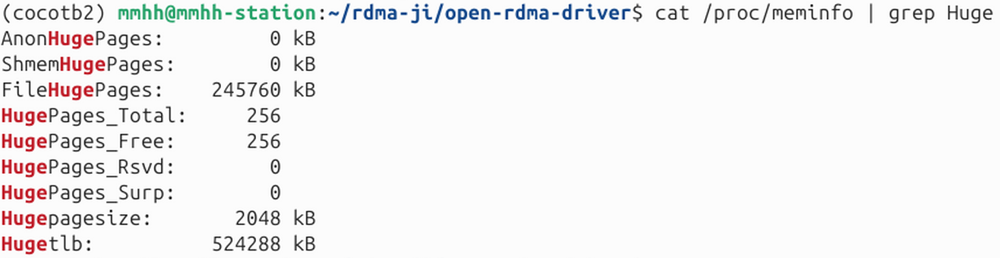

### 7. Build the Userspace Library (dtld-ibverbs)

Choose the build mode according to your use case:

**Mock mode (recommended for development and testing)**:

**Run the following in the root directory of the `open-rdma-driver` project**:

```bash
cd dtld-ibverbs
cargo build --no-default-features --features mock
cd ..
```

- Does not depend on real hardware or a simulator
- Suitable for rapid development and functional testing
- Performance test results are not realistic

Success indicator (since this command was run previously on this machine, no build logs are shown here):

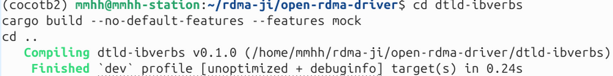

**Sim mode (for RTL simulator debugging)**:

**Run the following in the root directory of the `open-rdma-driver` project**:

```bash
cd dtld-ibverbs
cargo build --no-default-features --features sim
cd ..
```

- Requires the RTL simulator (from the open-rdma-rtl project) to be started first
- Used for hardware logic verification
- It is recommended to read this repository's [RTL Simulation Guide](./open-rdma-driver/docs/zh-CN/rtl-simulation.md) first, then follow the links to the `open-rdma-rtl` project documentation
- If you wish to directly use the driver-side automated script to run sim tests, please also refer to the [base_test Script Run Guide](./open-rdma-driver/docs/zh-CN/test/base_test_guide.md)
- You must start the simulator in a separate terminal before running tests (see the open-rdma-rtl project documentation)

Success indicator:

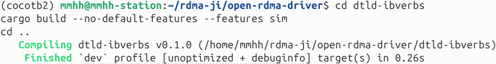

**Hardware mode (hw)**:

**Run the following in the root directory of the `open-rdma-driver` project**:

```bash
cd dtld-ibverbs
cargo build --no-default-features --features hw
cd ..
```

- ⚠️ **Note**: Hardware mode is not fully tested and may have issues
- Only use when real hardware devices are present

### 8. Build rdma-core

**Run the following in the root directory of the `open-rdma-driver` project**:

```bash
cd dtld-ibverbs/rdma-core-55.0

# Basic build
./build.sh

# To generate compile_commands.json for debugging:
# export EXTRA_CMAKE_FLAGS=-DCMAKE_EXPORT_COMPILE_COMMANDS=1
# ./build.sh

cd ../..
```

**Common issue**: If the build fails around 81% with a message like "size of unnamed array is negative", the path is too long. Please refer to: [Path Length Issue Detailed](./open-rdma-driver/docs/zh-CN/detail/path-length-issue.md)

A successful build reaches 100%:

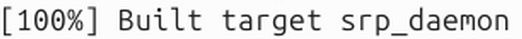

### 9. Set Environment Variables

**Method 1: Permanent setup (recommended)**

Add the environment variables directly to `~/.bashrc` so they are automatically loaded each time a terminal is opened.

**Run the following in the root directory of the `open-rdma-driver` project**:

```bash
# Add to .bashrc
cat >> ~/.bashrc << EOF

# Open RDMA Driver Environment
if [ -z "\$LD_LIBRARY_PATH" ]; then
    export LD_LIBRARY_PATH="$(pwd)/dtld-ibverbs/target/debug:$(pwd)/dtld-ibverbs/rdma-core-55.0/build/lib"
else
    export LD_LIBRARY_PATH="$(pwd)/dtld-ibverbs/target/debug:$(pwd)/dtld-ibverbs/rdma-core-55.0/build/lib:\$LD_LIBRARY_PATH"
fi
EOF

# Apply immediately
source ~/.bashrc
```

**Method 2: Temporary setup (current terminal only)**

**Run the following in the root directory of the `open-rdma-driver` project**:

```bash
# Use the provided script
source ./scripts/setup-env.sh

# Or set manually
export LD_LIBRARY_PATH=$PWD/dtld-ibverbs/target/debug:$PWD/dtld-ibverbs/rdma-core-55.0/build/lib
```

### 10. Verify Installation

#### Method 1: Use automated test framework (recommended for Sim mode)

The Open RDMA Driver provides an automated test framework that can automatically start the RTL simulator, build the driver and test programs, run tests, and collect logs. The test framework is located in the `tests/base_test/` directory.

**Environment preparation**:

The test framework needs access to the RTL simulator code (the `open-rdma-rtl` repository). There are two ways to configure the RTL path:

**Method 1: Use default path (recommended)**

Clone the `open-rdma-rtl` repository into the same parent directory as `open-rdma-driver`:

**Run in the parent directory** (if you are already in `open-rdma-driver`, first `cd ..`):

```bash
git clone https://github.com/open-rdma/open-rdma-rtl.git
```

The directory structure should be:

```
parent-directory/
├── open-rdma-driver/
└── open-rdma-rtl/
```

**Method 2: Custom RTL path**

If the RTL repository is located elsewhere, set the `RTL_DIR` environment variable:

**Set before running tests**:

```bash
export RTL_DIR="/path/to/your/open-rdma-rtl"
```

Or specify it when running a test:

```bash
RTL_DIR="/path/to/your/open-rdma-rtl" ./scripts/test_loopback_sim.sh
```

**Run the tests**:

**Run the following in the `open-rdma-driver/tests/base_test` directory**:

```bash
# Enter the test directory
cd tests/base_test

# Run a single test
./scripts/test_loopback_sim.sh 4096              # Loopback test
./scripts/test_send_recv_sim.sh 4096             # Send/Recv test
./scripts/test_rdma_write_sim.sh 4096 5          # RDMA Write test (5 rounds)
./scripts/test_write_imm_sim.sh 4096             # Write with Immediate test

# Run all tests
./scripts/run_all_tests.sh
```

Test logs are automatically saved in the `tests/base_test/log/sim/` directory. You can view detailed test output and RTL simulator logs.

**View test logs**:

```bash
# View loopback test logs
cat log/sim/rtl-loopback.log

# View send_recv test server logs
cat log/sim/send_recv/server.log

# View send_recv test client logs
cat log/sim/send_recv/client.log
```

If you encounter errors like those shown below when running `test_loopback_sim.sh 4096` (the following images show the error messages in the terminal and the rtl-loopback.log file respectively), the cause is that the IPv4 addresses configured on the two blue virtual network interfaces have been lost. You need to re-run the two commands `sudo ip addr add 17.34.51.10/24 dev blue0` and `sudo ip addr add 17.34.51.11/24 dev blue1` to reconfigure them, then run the test command again.

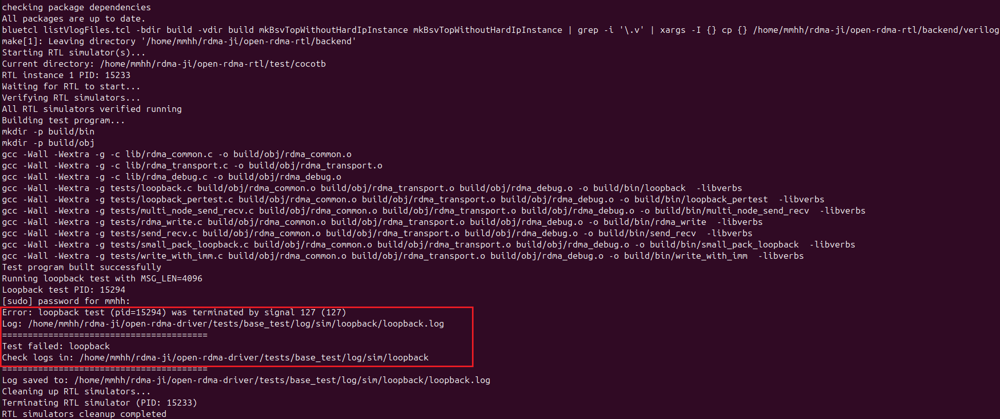

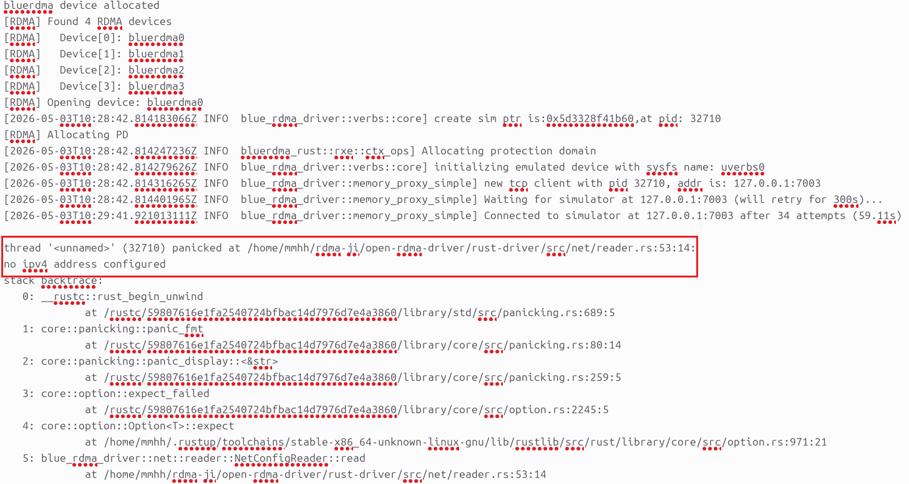

**Note**: The automated test framework will:

- Automatically build the Rust driver in sim mode
- Automatically start and stop the RTL simulator
- Automatically build the test programs
- Automatically run the server and client
- Collect all logs into the specified directory

**Test success indicators:**

**test_loopback_sim.sh 4096** passed

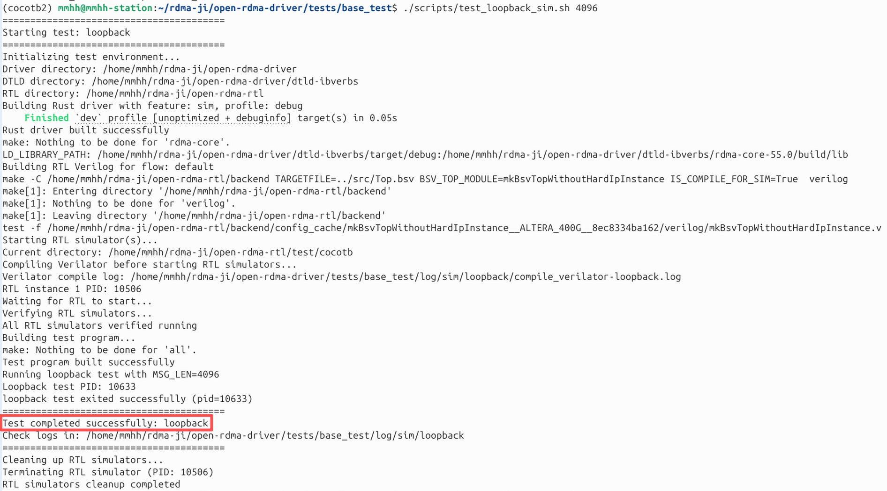

**test_send_recv_sim.sh 4096** passed

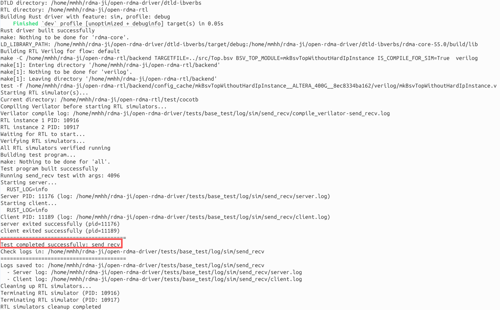

**test_rdma_write_sim.sh 4096 5** passed

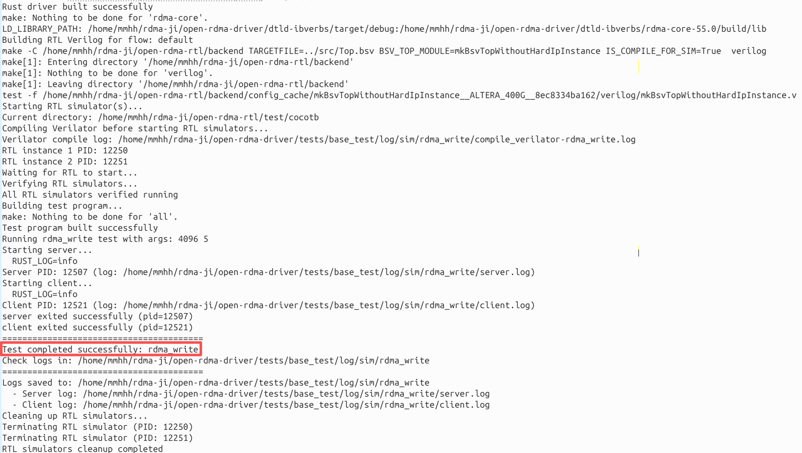

**test_write_imm_sim.sh 4096** passed

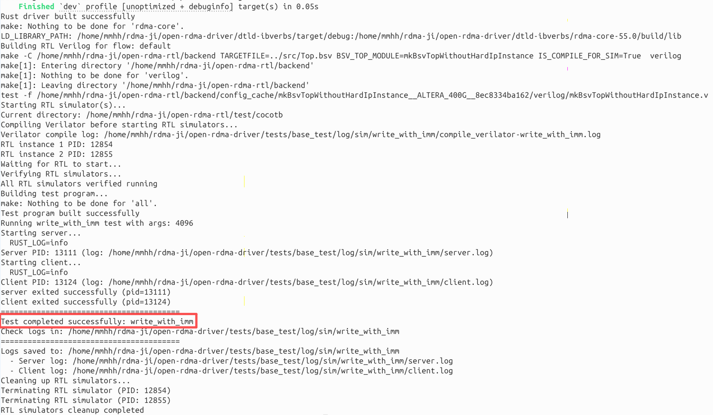

**run_all_tests.sh** passed

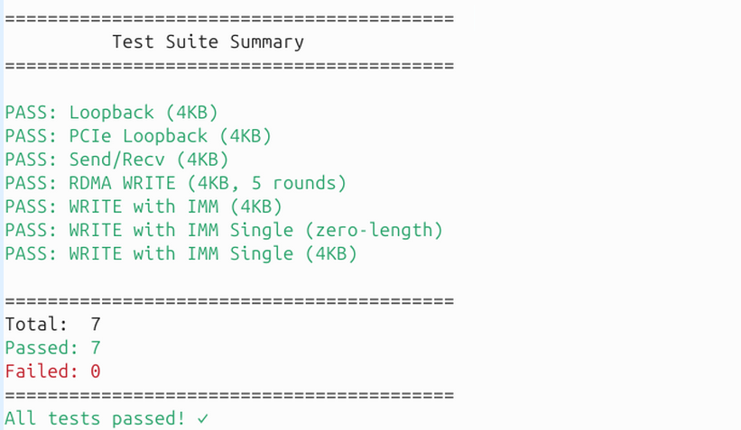

#### Method 2: Manually run example programs

**Build the example programs in the root directory of the `open-rdma-driver` project**:

```bash
cd examples
make
```

**Run the example programs**:

According to the mode selected during compilation:

##### Mock mode

**Single-end loopback test**:

**Run in the `open-rdma-driver/examples` directory**:

```bash
./loopback 8192
```

**Two-end test (send_recv)**:

**Terminal 1 (run in the `open-rdma-driver/examples` directory)**:

```bash
# Start the server
./send_recv 8192
```

**Terminal 2 (run in the `open-rdma-driver/examples` directory)**:

```bash
# Start the client, connect to the local server
./send_recv 8192 127.0.0.1
```

##### Sim mode

**Single-end loopback test**:

```bash
# 1. First start the simulator in a separate terminal (in the open-rdma-rtl project)
# Please see the open-rdma-rtl project documentation for the specific startup command

# 2. Run the test in the open-rdma-driver/examples directory
./loopback 8192
```

**Two-end test (send_recv)**:
You need to start two different simulator instances (see the open-rdma-rtl project documentation), then run:

**Terminal 3 (run in the `open-rdma-driver/examples` directory)**:

```bash
./send_recv 8192
```

**Terminal 4 (run in the `open-rdma-driver/examples` directory)**:

```bash
./send_recv 8192 127.0.0.1
```

##### Debug options

**To view detailed logs, add environment variables**:

```bash
RUST_LOG=debug ./loopback 8192
# or
RUST_LOG=debug ./send_recv 8192
```

A successful run will display output of RDMA operations.

## Quick Command Summary

**Note**: The following commands need to be run in specific directories. Please pay attention to the directory instructions.

```bash
# 1. Environment setup (run in any directory)
curl --proto '=https' --tlsv1.2 -sSf https://sh.rustup.rs | sh
sudo apt install cmake pkg-config libnl-3-dev libnl-route-3-dev libclang-dev libibverbs-dev

# 2. Clone the project (run in the directory where you want to place the project, use a short path if possible)
git clone --recursive https://github.com/open-rdma/open-rdma-driver.git
cd open-rdma-driver
git checkout dev

# ========== The following commands are run in the root directory of the open-rdma-driver project ==========

# 3. Build and load the driver (WSL2 needs kernel headers prepared first)
make && sudo make install

# 4. Configure network (run in any directory)
sudo ip addr add 17.34.51.10/24 dev blue0
sudo ip addr add 17.34.51.11/24 dev blue1

# 5. Allocate huge pages
sudo ./scripts/hugepages.sh alloc 512

# 6. Build the userspace library (choose mode: mock/sim/hw)
# Mock mode (recommended):
cd dtld-ibverbs && cargo build --no-default-features --features mock && cd ..
# Sim mode (requires simulator to be started first):
# cd dtld-ibverbs && cargo build --no-default-features --features sim && cd ..
# Hardware mode (not tested):
# cd dtld-ibverbs && cargo build --no-default-features --features hw && cd ..

# 7. Build rdma-core
cd dtld-ibverbs/rdma-core-55.0 && ./build.sh && cd ../..

# 8. Set environment variables (permanent) - run in the open-rdma-driver root directory
cat >> ~/.bashrc << EOF

# Open RDMA Driver Environment
if [ -z "\$LD_LIBRARY_PATH" ]; then
    export LD_LIBRARY_PATH="$(pwd)/dtld-ibverbs/target/debug:$(pwd)/dtld-ibverbs/rdma-core-55.0/build/lib"
else
    export LD_LIBRARY_PATH="$(pwd)/dtld-ibverbs/target/debug:$(pwd)/dtld-ibverbs/rdma-core-55.0/build/lib:\$LD_LIBRARY_PATH"
fi
EOF
source ~/.bashrc

# 9. Run examples - run in the open-rdma-driver project root directory
cd examples && make && ./loopback 8192

# 10. (Optional) Clone the RTL repository for automated testing
cd .. && git clone https://github.com/open-rdma/open-rdma-rtl.git
```

## Common Issues

### Q1: rdma-core build fails at 81%

**Cause**: The project path is too long, exceeding the Unix socket path limit.
**Solution**: Move the project to a shorter path (e.g., `/home/user/open-rdma-driver`).
**See**: [Path Length Issue](./open-rdma-driver/docs/zh-CN/detail/path-length-issue.md)

### Q2: Cannot find `infiniband/verbs_api.h`

**Cause**: Missing `libibverbs-dev` package.
**Solution**: `sudo apt install libibverbs-dev`

### Q3: Driver build fails on WSL, kernel headers not found

**Cause**: WSL does not provide kernel headers by default.
**Solution**: Follow step 3 to compile the WSL2 kernel and link the headers.
**See**: [WSL2 Kernel Headers Preparation Guide](./open-rdma-driver/docs/zh-CN/detail/wsl-kernel-headers.md)

### Q4: No RDMA devices found when running examples, or shared library not found

**Cause**: `LD_LIBRARY_PATH` may not be set.
**Solution**: Run `source ./scripts/setup-env.sh`

### Q5: OFED conflicts with vanilla RDMA

**See**: [Switch to vanilla RDMA](./open-rdma-driver/docs/zh-CN/detail/switch-to-vanilla-rdma.md)

### Q6: How to choose the build mode (mock/sim/hw)?

**Mock mode**: Recommended for development and functional testing, no hardware or simulator required.
**Sim mode**: For RTL simulation verification, requires the simulator to be started first.
**Hardware mode**: Only use when real hardware devices are present, ⚠️ currently not fully tested.

### Q7: IPv4 addresses on blue virtual network interfaces are lost during testing or after environment reset

If you encounter errors like those shown below when running `test_loopback_sim.sh 4096` (the following images show the error messages in the terminal and the rtl-loopback.log file respectively), the cause is that the IPv4 addresses configured on the two blue virtual network interfaces have been lost. You need to re-run the two commands `sudo ip addr add 17.34.51.10/24 dev blue0` and `sudo ip addr add 17.34.51.11/24 dev blue1` to reconfigure them, then run the test command again.


### Q8: Example programs in Sim mode do not run

**Cause**: RTL simulator not started.
**Solution**:

1. **Recommended method**: Use the automated test framework (see Method 1 in step 10), which automatically starts and manages the RTL simulator.
2. **Manual method**: Start the simulator in a separate terminal (see the open-rdma-rtl project documentation) before running the test program.

### Q9: Automated test reports "RTL directory not found"

**Cause**: RTL repository path not correctly configured.
**Solution**:

1. **Method 1**: Clone the `open-rdma-rtl` repository into the same parent directory as `open-rdma-driver`:

   ```bash
   cd /path/to/parent-directory
   git clone https://github.com/open-rdma/open-rdma-rtl.git
   ```

2. **Method 2**: Set the environment variable `RTL_DIR` to point to your RTL repository path:

   ```bash
   export RTL_DIR="/path/to/your/open-rdma-rtl"
   ```

## Related Documents

- [WSL2 Kernel Headers Preparation Guide](./open-rdma-driver/docs/zh-CN/detail/wsl-kernel-headers.md)
- [Path Length Issue Detailed](./open-rdma-driver/docs/zh-CN/detail/path-length-issue.md)
- [OFED Symbol Version Fix](./open-rdma-driver/docs/zh-CN/detail/ofed-symbol-version-fix.md)
- [OFED RoCE Registration Issue](./open-rdma-driver/docs/zh-CN/detail/ofed-roce-registration-issue.md)
- [Switch to vanilla RDMA](./open-rdma-driver/docs/zh-CN/detail/switch-to-vanilla-rdma.md)
- [Automated Test Framework Guide](./open-rdma-driver/tests/base_test/README.md)
- [Test Script Usage Guide](./open-rdma-driver/tests/base_test/scripts/README.md)