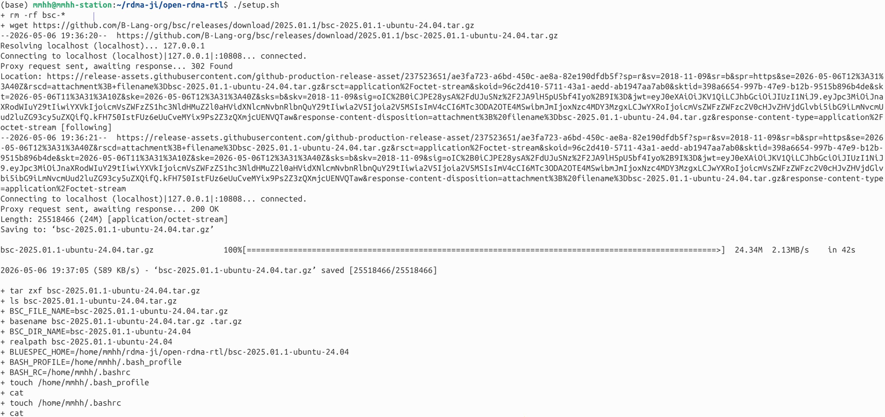
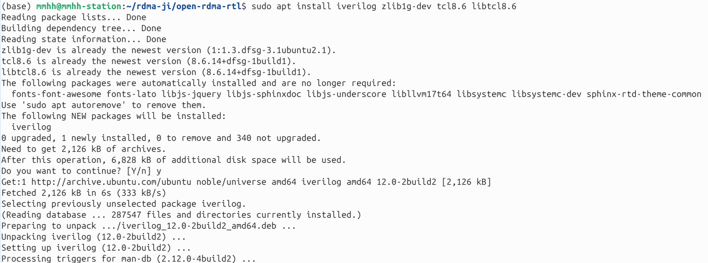
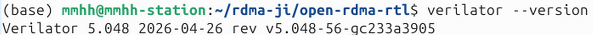
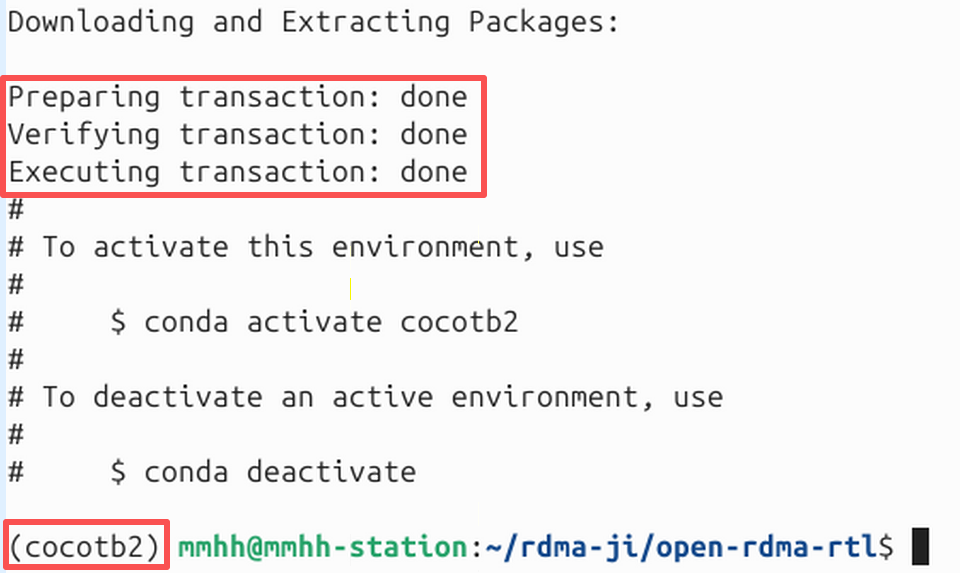
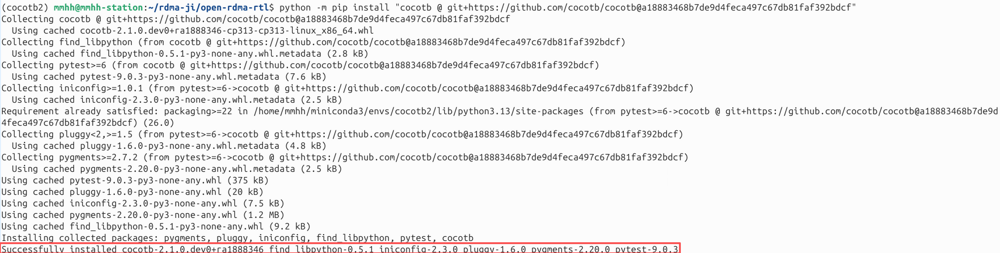
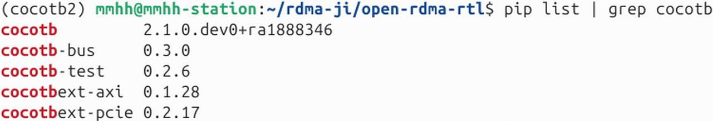
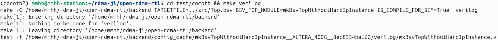

# Open RDMA RTL Hardware Simulation Project Installation

> **Note**: This document describes the standalone `open-rdma-rtl` hardware simulation project, which is in a different repository from the `open-rdma-driver` project.

If you came here from the installation or testing documentation of `open-rdma-driver`, you may also refer to:

- Driver installation and usage: [installation.md](./installation.md)
- Driver one-click test guide: [base_test script run guide](./test/base_test_guide.md)

For lower-level RTL simulation details such as cocotb, BSV compilation, and RTL simulator startup, please refer to the scripts and documentation in the `open-rdma-rtl` repository.

## Installation Steps

### 1. Clone the Project

**Run the following commands in the directory where you want to place the project**:

```bash
git clone https://github.com/open-rdma/open-rdma-rtl.git
cd open-rdma-rtl
git checkout dev
```

### 2. Install BSC

**Run the following in the root directory of the `open-rdma-rtl` project**:

```
./setup.sh  # installs bsc and adds environment variables to ~/.bashrc
```

**Note**: Make sure the bsc version matches your Ubuntu version (e.g., Ubuntu 22.04 requires bsc-2023.01-ubuntu-22.04).



### 3. Install Simulation Dependencies

**System dependencies**:

```
sudo apt install iverilog zlib1g-dev tcl8.6 libtcl8.6
```



Install the latest Verilator from GitHub (stable branch):

```
sudo apt install -y help2man
git clone https://github.com/verilator/verilator
cd verilator
git checkout stable
autoconf
./configure
make -j $(nproc)
sudo make install
cd ..
```

Verify installation:

```
verilator --version
```

A successful installation shows the verilator version:



**Python dependencies**:

Install conda (other Python environments also work):

```
mkdir -p ~/miniconda3
wget https://repo.anaconda.com/miniconda/Miniconda3-latest-Linux-x86_64.sh -O ~/miniconda3/miniconda.sh
bash ~/miniconda3/miniconda.sh -b -u -p ~/miniconda3
rm ~/miniconda3/miniconda.sh

source ~/miniconda3/bin/activate
conda init --all
```

It is recommended to create a dedicated Python environment to avoid conflicts with the system environment or other `cocotb` versions:

```
conda create -n cocotb2 python=3.13
conda activate cocotb2
```

After successful environment creation, you will see an indicator; after activation, the command line will show the virtual environment name:



First install the development version of `cocotb` (this document uses commit `a18883468b7de9d4feca497c67db81faf392bdcf` from the `cocotb` repository):

```
python -m pip install "cocotb @ git+https://github.com/cocotb/cocotb@a18883468b7de9d4feca497c67db81faf392bdcf"
```



Then install the Python dependencies that match the simulation environment:

```
python -m pip install cocotb-test cocotbext-axi scapy
python -m pip install "cocotbext-pcie @ git+https://github.com/open-rdma/cocotbext-pcie"
```

Check the installation results with:

```
python -m pip show cocotb cocotb-bus cocotbext-pcie cocotbext-axi cocotb-test
python -m pip check
cocotb-config --version
```

Or check with:

```
pip list | grep cocotb
```

Installation result: a version display indicates success.



**Notes**:

- This document uses the `cocotb` dev version, not the stable `1.9.2` from PyPI.
- Currently tested compatible combinations include `cocotb-bus 0.3.0`, `cocotbext-axi 0.1.28`, `cocotb-test 0.2.6`.
- `cocotbext-pcie` uses the open-rdma specific version: `https://github.com/open-rdma/cocotbext-pcie`.
- If you have previously installed `cocotb==1.9.2` or other older versions, it is recommended to reinstall in a new environment to avoid leftover dependencies interfering with simulation.
- If you encounter `VerilatedVpi::*` compilation errors or `No GPI_USERS specified, exiting...`, please refer to: [cocotb dev environment GPI_USERS and Verilator compatibility note](https://./detail/cocotb-gpi-users-and-verilator-compat.md)

**Additional notes**:

- Simulation uses `verilator` (not `iverilog`).
- `tcl8.6` and `libtcl8.6` are required for BSC backend compilation.

### 4. Compile the Backend

**Run the following in the root directory of the `open-rdma-rtl` project**:

```
cd test/cocotb && make verilog
```

Expected output:



The generated Verilog files are located in the `backend/verilog/` directory.

### 5. Run System-Level Tests

**Single-card loopback test** (recommended for quick validation):

**Run the following in the root directory of the `open-rdma-rtl` project**:

```
cd test/cocotb
make run_system_test_server_loopback
```

**Two-card test** (requires two terminals running simultaneously):

**Terminal 1 (run in the root directory of the `open-rdma-rtl` project)**:

```
# Start server 1 (INST_ID=1)
cd test/cocotb
make run_system_test_server_1
```

**Terminal 2 (run in the root directory of the `open-rdma-rtl` project)**:

```
# Start server 2 (INST_ID=2)
cd test/cocotb
make run_system_test_server_2
```

Test logs are saved in the `test/cocotb/log/` directory (with `.loopback`, `.1`, `.2` suffixes).

## Integration with Open RDMA Driver

The driver must be compiled in sim mode, and other driver settings must be completed.

**Run the following in the root directory of the `open-rdma-driver` project**:

```
cd dtld-ibverbs
cargo build --no-default-features --features sim
cd ..
```

The `sim` mode of the Open RDMA Driver requires the simulator from this project to be started first:

### Single-ended test (loopback)

**Terminal 1 (run in the root directory of the `open-rdma-rtl` project)**:

```
# Start the hardware simulator
cd test/cocotb
make run_system_test_server_loopback
```

**Terminal 2 (run in the root directory of the `open-rdma-driver` project)**:

```
# Run the driver test
cd examples
make
RUST_LOG=debug ./loopback 8192
```

### Two-ended test (send_recv)

**Terminal 1 (run in the root directory of the `open-rdma-rtl` project)**:

```
# Start hardware simulator 1
cd test/cocotb
make run_system_test_server_1
```

**Terminal 2 (run in the root directory of the `open-rdma-rtl` project)**:

```
# Start hardware simulator 2
cd test/cocotb
make run_system_test_server_2
```

**Terminal 3 (run in the root directory of the `open-rdma-driver` project)**:

```
# Compile and run the driver test server
cd examples
make
RUST_LOG=debug ./send_recv 8192
```

**Termnal 4 (run in the root directory of the `open-rdma-driver` project)**:

```
# Run the driver test client
cd examples
RUST_LOG=debug ./send_recv 8192 127.0.0.1
```